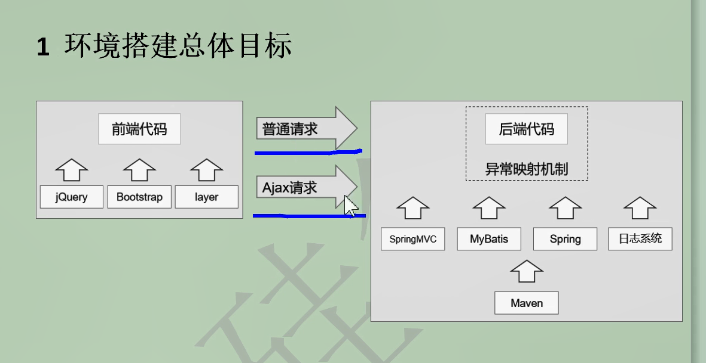
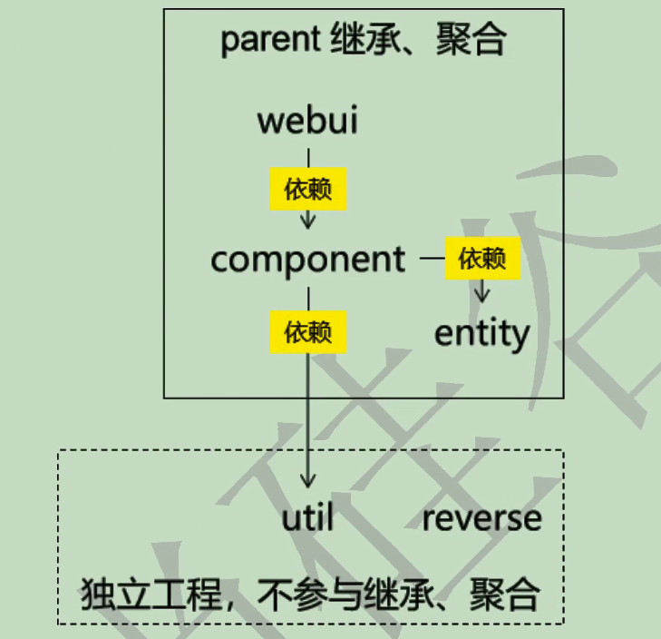

- 课程定位
  - 从单一架构阶段到分布式架构阶段的过渡。后台管理员系统使用单一架构开发。前台会
  员系统使用分布式架构开发
- 前置要求
    - Spring
    - SpringMVC
    - MyBatis
    - Maven
- 整体思路
  - 点：具体技术点
  - 线：每一个请求的处理过程是一条线，对应Tomcat 的线程池中的一个线程
  - 面：多个请求组织在一起完成一个特定模块的功能
  - 体：多个模块组合在一起构成一个完整的项目
- 学习方法
  - 养兵千日，用兵一时：着眼点要从学习具体技术的语法转变为思考如何实现业务功
    能需求。
  - 点线面体整体思想
    - 点：具体技术点
    - 线：每一个请求的处理过程是一条线，对应Tomcat 的线程池中的一个线程
    - 面：多个请求组织在一起完成一个特定模块的功能
    - 体：多个模块组合在一起构成一个完整的项目
  - 功能实现方式
    - 目标：聚焦当前要完成的任务。目标明确后才能分析实现的思路。甚至有的时候需
      要对大目标进行拆解，把很多小目标各个击破。
    - 思路：针对目标的达成进行分析。具体到项目功能的实际开发中，体现为**流程图**。
    - 代码：参照思路分析时绘制的流程图，把步骤翻译成写代码时的注释，再对照注释
     具体编写代码。



- 普通请求 与 ajax 请求
  - 普通请求获取页面
  - ajax 请求 获取json数据


- 项目架构
  - 
    - 继承与聚合
      - 继承 : 父工程(dependency-management)管理子工程(dependency)的依赖版本信息(properties) , 需要升级jar包时 , 只需要在父工程修改就会使得被管理的子工程也生效
      - 聚合 : 如 webui, component , entity 是模块工程 , 多个模块工程组成的整体就是聚合工程。parent中有一个modules 可以看到项目中都有哪些模块
        - 实际的好处 : 执行mvn install 命令, 所有被聚合的模块工程就可以一键安装
      - 工程创建计划
         - 打包方式 : pom, war , jar
          ```xml
          atcrowdfunding01-admin-parent
          groupId：com.atguigu.crowd
          artifactId：atcrowdfunding01-admin-parent
          packaging：pom
        
          atcrowdfunding02-admin-webui  
          groupId：com.atguigu.crowd
          artifactId：atcrowdfunding02-admin-webui
          packaging：war
        
        
          atcrowdfunding03-admin-component
          groupId：com.atguigu.crowd
          artifactId：atcrowdfunding03-admin-component
          packaging：jar
        
          atcrowdfunding04-admin-entity
          groupId：com.atguigu.crowd
          artifactId：atcrowdfunding04-admin-entity
          packaging：jar
        
          atcrowdfunding05-common-util
          groupId：com.atguigu.crowd
          artifactId：atcrowdfunding05-common-util
          packaging：jar
        
          atcrowdfunding06-common-reverse
          groupId：com.atguigu.crowd
          artifactId：atcrowdfunding06-common-reverse
          packaging：jar
          ```